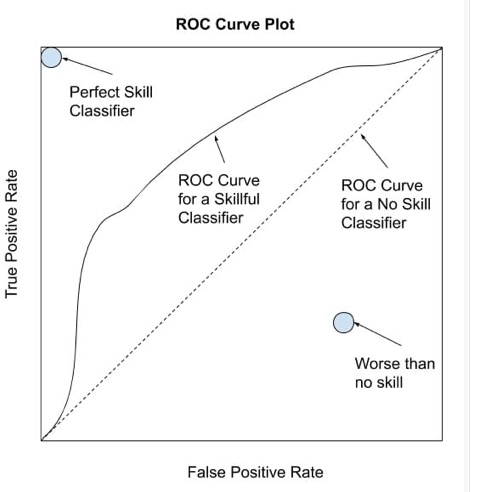
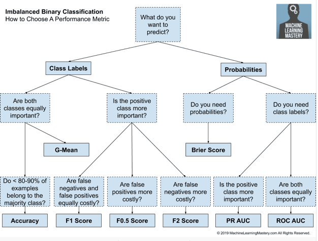

## Question : Choosing wrong metrics

Let's assume you are working with a severely imbalanced dataset.

We've all been there. It's a pretty typical scenario.

Now let's imagine you want to split the data into two categories using a classification learning algorithm.

It's hard to pick the best evaluation metric for this problem if we don't know what we want to accomplish. But at least we can rule out the ones that we shouldn't use.

Which of the following metrics should you avoid using when evaluating your model's performance?

1. Recall

2. Precision

3. F1-Score

4. Accuracy

## Review of Related Concept

The correct evaluation of learned models is one of the most important issues in Machine Learning.

An evaluation metric quantifies the performance of a predictive model. A classifier is good if we choose the wright metrics. Wrong metrics may lead us to choose a wrong model or mislead us about the result. Again, all the existing metrics make assumptions about the problem you have.

> Therefore an evaluation metric must be chosen that best captures what you or your project stakeholders believe is important about the model or predictions, which makes choosing model evaluation metrics challenging.

Unlike balance classification problem which treats classes as equally important, imbalance classification problem is difficult because it rate the classification errors with minority class as more important than those with majority class.

> "The main problem of imbalanced data sets lies on the fact that they are often associated with a user preference bias towards the performance on cases that are poorly represented in the available data sample." A Survey of Predictive Modelling under Imbalanced Distributions, 2015.

Evaluation Metrics can fall in to the following categories

1. Threshold Metrics : Threshold metrics are those that quantify the classification prediction errors. Examples includes: Accuracy, Error, Precision, Recall, F-Measure,   Kappa, Macro-Average Accuracy, Mean-Class-Weighted Accuracy, Optimized Precision, Adjusted Geometric Mean, Balanced Accuracy, and more.

> One limitation of threshold metric metrics is that they assume that the class distribution observed in the training dataset will match the distribution in the test set and in real data when the model is used to make predictions. This is often the case, but when it is not the case, the performance can be quite misleading.

Ranking metrics don’t make any assumptions about class distributions.

2. Ranking Metrics : Rank metrics are more concerned with evaluating classifiers based on how effective they are at separating classes. Rank metrics predicts a score or a probability of class membership. EXamples includes: The ROC Curve or ROC Analysis

> A ROC curve is a diagnostic plot for summarizing the behavior of a model by calculating the false positive rate and true positive rate for a set of predictions by the model under different thresholds.

From the figure above, a classifier that has no skill (e.g. predicts the majority class under all thresholds) will be represented by a diagonal line from the bottom left to the top right.

Any points below this line have worse than no skill. A perfect model will be a point in the top left of the plot.

A no skill classifier will have a score of 0.5, whereas a perfect classifier will have a score of 1.0.

> Although generally effective, the ROC Curve and ROC AUC can be optimistic under a severe class imbalance, especially when the number of examples in the minority class is small. An alternative to the ROC Curve is the precision-recall curve that can be used in a similar way, although focuses on the performance of the classifier on the minority class.

1. Probability Metrics: Probabilistic metrics are designed specifically to measure the uncertainty in a classifier’s predictions. Example is log loss for binary classification (or the negative log likelihood), or known more generally as cross-entropy.

> "Metrics based on a probabilistic understanding of error, i.e. measuring the deviation from the true probability […] These measures are especially useful when we want an assessment of the reliability of the classifiers, not only measuring when they fail but whether they have selected the wrong class with a high or low probability". An Experimental Comparison Of Performance Measures For Classification, 2008.

#### Choosing Correct Metrics

There are many approach for one to choose correct evaluation metrics for his problem:
 
1.  The first solution is talk to project stakeholders and understand what is important about the prediction. This will give a clue wich metrics is suitable for the problem at hand.

2. Look at the similar problem and how people choose metrics. You may find the most commonly use metrics by academics and practioners that you can adapt and use.

      

### Imbalance Classification

Most machine learning algorithm for classification were design with assumption of equal number of classes. This means when they are used in imbalance settings, we will have a poor or misleading performance. The model can also have poor predictive capacity for the minority class. This is a problem because typically, the minority class is more important and therefore the problem is more sensitive to classification errors for the minority class than the majority class.

> Inbalance vs Unbalance:  Unbalance refers to a class distribution that was balanced and is now no longer balanced, whereas imbalanced refers to a class distribution that is inherently not balanced. 

Inbalance predictive modelling is sometimes called: Rare event prediction, extreme event prediction or severe class imbalanc

### Causes of Imbalance

Two main causes for imbalance: 

1. Data sampling: Inbalance may be introduced during data collection or data sampling. This cause what is called measurement error and biased samplin.

   
2.  Properties of the domain. The imbalance might be a property of the problem domain. Since natural occurance of an even is not likely equal.

### Types of Imbalance

The imbalance can be either slight imbalance (e.g 4:6) or severe imbalance(e.g 1:100). The challenge is with severe imblance as slight imbalance can be treated as balance class.

> Most of the contemporary works in class imbalance concentrate on imbalance ratios ranging from 1:4 up to 1:100. […] In real-life applications such as fraud detection or cheminformatics we may deal with problems with imbalance ratio ranging from 1:1000 up to 1:5000.

### Working with Imbalanced Dataa

In imbalance classification setting, minority class is of interest and harder to predict. Therefore model's skill to predict correct class for the minority is more important than the majority class. 

> … "the learning process of most classification algorithms is often biased toward the majority class examples, so that minority ones are not well modeled into the final system."

## Answer

Let's illustrate this with a hypothetical example.

Let's imagine that your team wants to build a machine learning model to predict whether a specific car will get in an accident.

You are pretty funny, so you decide to play a prank on everyone else by committing this as a solution to the problem:

def is_the_car_going_to_crash_today():
    return False

Your team evaluates the model against a test set, and your dummy code is 99% accurate!

The National Safety Council reports that the odds of being in a car crash in the United States are less than 1%. This means that even the dumb function above will be very accurate!

The problem here is probably obvious by now: Accuracy is not a good metric when you face a very imbalanced problem. You can achieve very high accuracy even with a model that does nothing useful.

Some examples of imbalanced problems:

- Detecting fraudulent transactions
- Classifying spam messages
- Determining if a patient has cancer

The other three metrics will give you much more information than accuracy, depending on the problem and how you want to approach it.

In summary, the fourth choice is the correct answer to this question.

## Recommended reading

1. [Random Oversampling and Undersampling for Imbalanced Classification](https://machinelearningmastery.com/random-oversampling-and-undersampling-for-imbalanced-classification/)

2. Check ["Failure of Classification Accuracy for Imbalanced Class Distributions"](https://machinelearningmastery.com/failure-of-accuracy-for-imbalanced-class-distributions/) to understand 
why accuracy fails when working with imbalanced datasets.

3. If you are into Twitter, [here](https://twitter.com/svpino/status/1357302018428256258) is a much more detailed story about predicting crashes with 99% accuracy.

See you tomorrow for another question!

