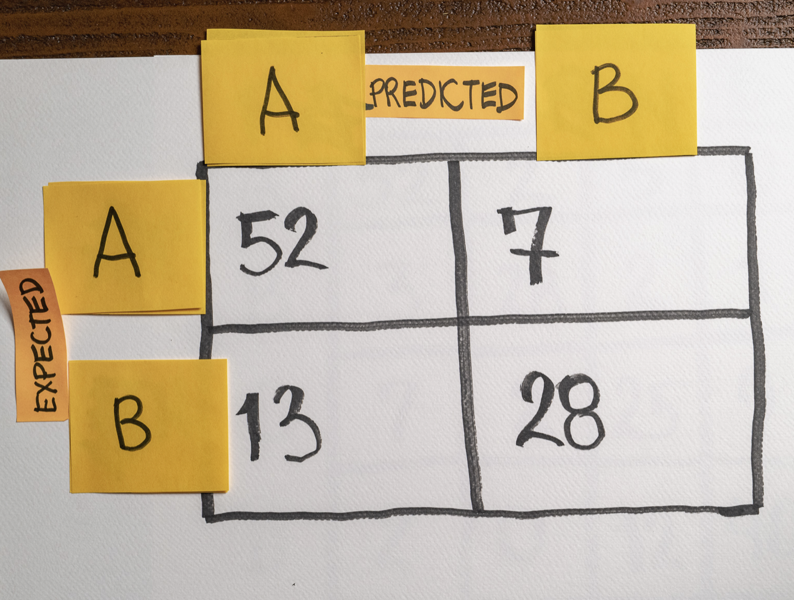

## True Positives

Here is the picture of a confusion matrix we generated after evaluating a model in a dataset with 100 samples:

           

Assume that class B represents the outcomes of the model we are interested in finding.

What's the total of True Positives on this evaluation round?

1. True Positives are class A samples the model predicted as class B, so the answer is 7.

2. True Positives are class B samples the model predicted as class A, so the answer is 13.

3. True Positives are class A samples the model predicted as class A, so the answer is 52.

4. True Positives are class B samples the model predicted as class B, so the answer is 28.

## Answer

We are interested in samples from class B, which means we will treat class B as our "Positive" samples and class A as our "Negative" samples.

If we replace the classes in the confusion matrix with Positive and Negative instead of "B" and "A," it's much easier to reason about the model's number of True Positives:

True Positives are those samples that we expect to be Positive (class B), and the model predicted as Positive (class B.) Therefore, the correct answer to the question is 28. You can see every combination in the image above.

## Recommended reading

1. Check ["Confusion Matrix"](https://articles.bnomial.com/confusion-matrix) for a full explanation of how a confusion matrix works and how you can use them as part of your work.

2. Check ["When accuracy doesn't help"](https://articles.bnomial.com/when-accuracy-doesnt-help) for an introduction to precision, recall, and f1-score metrics to measure a machine learning model's performance.
